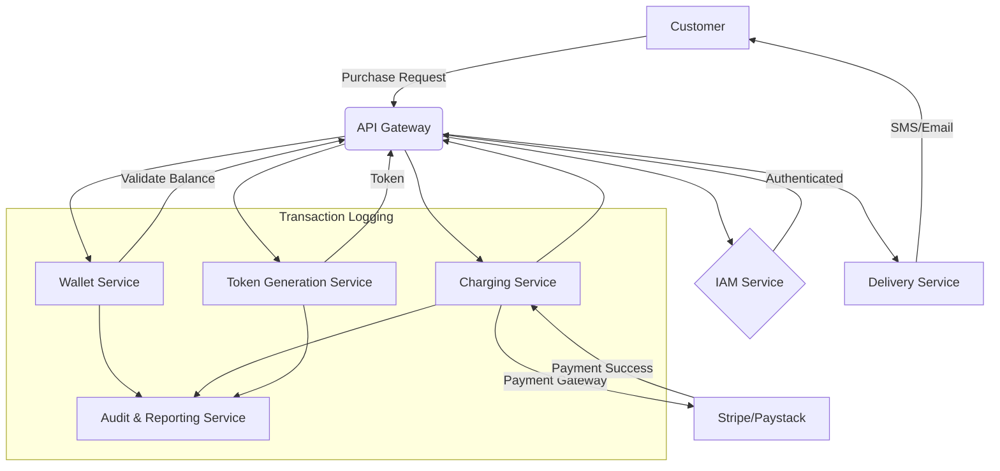

# High-Level System Design: Prepaid Meter Token Purchase Platform

This document outlines the high-level architecture, database design, API specifications, and operational strategies for a prepaid meter token purchase platform for a utility company.

## 1. High-Level Architecture

The system is designed using a microservices architecture to ensure scalability, resilience, and maintainability. The core components are:

- **API Gateway**: The single entry point for all client requests. It handles request routing, rate limiting, and authentication.
- **Identity & Access Management (IAM) Service**: Manages user authentication (JWT-based) and authorization (role-based access control).
- **Wallet Service**: Manages customer account balances, including debiting for purchases and crediting for refunds.
- **Charging Service**: Integrates with payment gateways (e.g., Stripe, Paystack) to process payments.
- **Token Generation Service**: Generates unique prepaid meter tokens.
- **Delivery Service**: Delivers tokens to customers via SMS, email, or push notifications.
- **Audit & Reporting Service**: Provides a complete audit trail for all transactions and generates financial reports.

### Data Flow Diagram (Mermaid)



## 2. Database Design

We will use a combination of databases to meet the requirements:

- **PostgreSQL (OLTP)**: For transactional data requiring strong consistency (wallets, transactions, tokens).
- **ClickHouse (OLAP)**: For high-throughput writes and complex queries on audit logs and reporting data.

### PostgreSQL Schema

```sql
CREATE TABLE wallets (
    wallet_id UUID PRIMARY KEY,
    user_id UUID NOT NULL,
    balance DECIMAL(10, 2) NOT NULL,
    currency VARCHAR(3) NOT NULL,
    created_at TIMESTAMPTZ NOT NULL DEFAULT NOW(),
    updated_at TIMESTAMPTZ NOT NULL DEFAULT NOW()
);

CREATE TABLE transactions (
    transaction_id UUID PRIMARY KEY,
    wallet_id UUID REFERENCES wallets(wallet_id),
    amount DECIMAL(10, 2) NOT NULL,
    type VARCHAR(10) NOT NULL, -- 'debit' or 'credit'
    status VARCHAR(10) NOT NULL, -- 'pending', 'success', 'failed'
    payment_gateway_ref VARCHAR(255),
    created_at TIMESTAMPTZ NOT NULL DEFAULT NOW()
);

CREATE TABLE tokens (
    token_id UUID PRIMARY KEY,
    transaction_id UUID REFERENCES transactions(transaction_id),
    meter_number VARCHAR(50) NOT NULL,
    token_value VARCHAR(255) NOT NULL,
    is_delivered BOOLEAN DEFAULT FALSE,
    created_at TIMESTAMPTZ NOT NULL DEFAULT NOW()
);
```

### ClickHouse Schema (for Audit Logs)

```sql
CREATE TABLE audit_logs (
    event_id UUID,
    service_name String,
    event_type String,
    payload String,
    timestamp DateTime
) ENGINE = MergeTree()
PARTITION BY toYYYYMM(timestamp)
ORDER BY (timestamp, event_id);
```

## 3. API Design

### Key Endpoints

- `POST /v1/purchase/token`
  - **Request**: `{ "meter_number": "string", "amount": number }`
  - **Success Response (202 Accepted)**: `{ "transaction_id": "uuid", "status": "pending" }`
  - **Error Responses**: `400` (Bad Request), `401` (Unauthorized), `402` (Insufficient Funds), `429` (Rate Limit Exceeded)

- `GET /v1/transactions/{transaction_id}`
  - **Success Response (200 OK)**: `{ "transaction_id": "uuid", "status": "string", "token": "string" }`
  - **Error Responses**: `404` (Not Found)

### Error Handling & Idempotency

- **Idempotency**: The `POST /v1/purchase/token` endpoint will be idempotent. Clients can provide an `Idempotency-Key` in the header. The server will cache the result of the first request for a given key.
- **Partial Failures**: A distributed saga pattern will be used to handle partial failures. If any step in the purchase pipeline fails, compensating transactions will be triggered to roll back the changes (e.g., refund the payment if token generation fails).

## 4. Scalability Strategy

- **Horizontal Scaling**: All microservices will be stateless and containerized (Docker), allowing for horizontal scaling via an orchestrator like Kubernetes.
- **Auto-Scaling**: Kubernetes Horizontal Pod Autoscaler (HPA) will be configured to automatically scale pods based on CPU and memory usage.
- **Database Scaling**: PostgreSQL will be configured with read replicas to handle read-heavy queries for reporting. ClickHouse is inherently distributed and can be scaled by adding more nodes.

## 5. Financial Consistency Model

- **Two-Phase Commit (2PC)**: For the critical path of charging the wallet and generating a token, a 2PC-like protocol will be implemented to ensure atomicity.
- **Reconciliation**: A background reconciliation service will periodically compare transaction logs from the payment gateway with the internal transaction records to identify and correct any discrepancies.

## 6. Monitoring & Observability

- **Metrics**: Prometheus will be used to collect key metrics (e.g., transaction throughput, latency, error rates).
- **Logging**: Centralized logging with the ELK stack (Elasticsearch, Logstash, Kibana) for debugging and analysis.
- **Tracing**: Jaeger for distributed tracing to monitor request flows across microservices.
- **Alerting**: Alertmanager will be configured to send alerts on critical issues (e.g., high failure rates, service downtime).

## 7. Implementation Roadmap

### Phase 1: Core Services (MVP)
- Implement IAM, Wallet, and Charging services.
- Basic token generation and delivery.
- Setup core infrastructure (Kubernetes, PostgreSQL).

### Phase 2: Scalability & Resilience
- Implement auto-scaling and load balancing.
- Introduce circuit breakers (e.g., using Istio) and retry mechanisms.
- Setup monitoring and alerting.

### Phase 3: Audit & Reporting
- Implement the Audit & Reporting service with ClickHouse.
- Build financial reporting dashboards.
- Conduct security audits and penetration testing.
